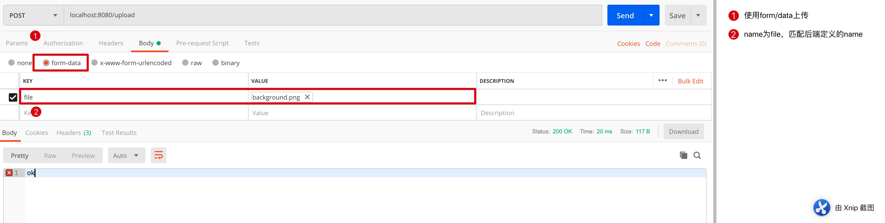
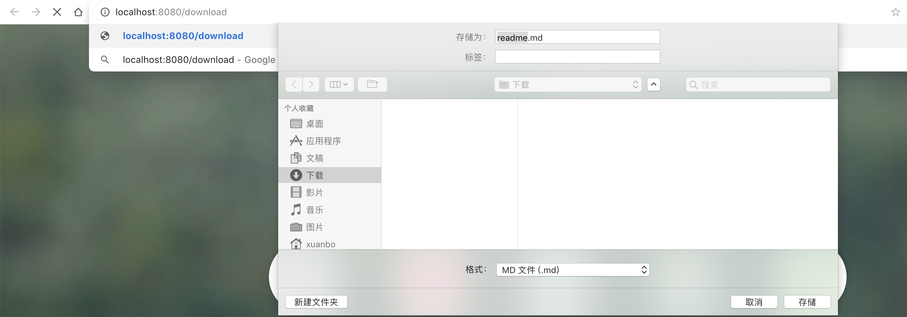
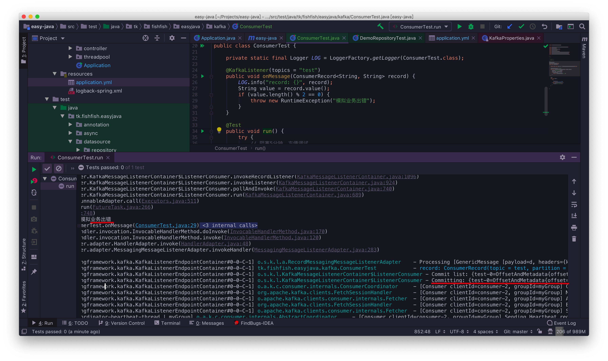

# easy-java

整理java技术要点，让java更简单，更容易上手。

## 约定

* `spring-boot`集成默认是2.x
* `MySQL`数据库默认编码为`utf8mb4`

## 导航

* [maven](#maven)
* [IO](#IO)
* [线程池](#线程池)
* [spring-boot](#spring-boot)
* [注解](#注解)
* [日志](#日志)
* [测试](#测试)
* [数据库连接池](#数据库连接池)
* [Future模式](#Future模式)
* [ORM](#ORM)
* [Redis](#Redis)
* [Excel导入导出](#Excel导入导出)
* [Kafka](#Kafka)
* [Hive](#Hive)
* [HBase](#HBase)
* [待续](#待续)

## maven

### pom.xml模板

对于maven项目，推荐使用java8、项目编码为utf8。对于国内的开发者而言，为了下载包更快，推荐使用aliyun仓库。

```xml
<?xml version="1.0" encoding="UTF-8"?>
<project xmlns="http://maven.apache.org/POM/4.0.0"
         xmlns:xsi="http://www.w3.org/2001/XMLSchema-instance"
         xsi:schemaLocation="http://maven.apache.org/POM/4.0.0 http://maven.apache.org/xsd/maven-4.0.0.xsd">
    <modelVersion>4.0.0</modelVersion>

    <groupId>tk.fishfish</groupId>
    <artifactId>easy-java</artifactId>
    <version>1.0.0</version>

    <properties>
        <maven.compiler.source>1.8</maven.compiler.source>
        <maven.compiler.target>1.8</maven.compiler.target>
        <project.build.sourceEncoding>utf-8</project.build.sourceEncoding>
    </properties>

    <repositories>
        <repository>
            <id>aliyunmaven</id>
            <name>aliyun maven</name>
            <url>http://maven.aliyun.com/nexus/content/groups/public/</url>
        </repository>
    </repositories>

    <build>
        <plugins>
            <plugin>
                <groupId>org.apache.maven.plugins</groupId>
                <artifactId>maven-compiler-plugin</artifactId>
                <version>3.8.0</version>
                <configuration>
                    <source>1.8</source>
                    <target>1.8</target>
                </configuration>
            </plugin>
        </plugins>
    </build>

</project>
```

### maven多模块

对于多模块依赖项目，请看[示例工程](https://github.com/xuanbo/parent)

### 跳过测试

在打包的时候，为了跳过测试，可以使用命令：

```shell
> mvn clean package -DskipTests
```

其中：

* `-DskipTests`参数用于跳过测试。

## IO

IO在工作中会经常遇到，比如文件复制、读写、WEB文件上传/下载等。

建议：工作中尽量使用工具类，能不写`new BufferedInputStream(new FileInputStream("file"))`就不写。

### 文件复制

对于文件复制，这里不介绍各种`FileUtils`、`FileCopyUtils`等。

介绍JDK7中优雅的工具类`Paths`、`Files`使用：

```java
package tk.fishfish.easyjava.io;

import org.junit.Test;
import org.slf4j.Logger;
import org.slf4j.LoggerFactory;

import java.io.IOException;
import java.nio.file.Files;
import java.nio.file.Path;
import java.nio.file.Paths;

/**
 * 文件复制
 *
 * @author 奔波儿灞
 * @since 1.0
 */
public class FileCopyTest {

    private static final Logger LOG = LoggerFactory.getLogger(FileCopyTest.class);

    @Test
    public void copy() {
        Path source = Paths.get("./readme.md");
        Path target = Paths.get("./readme.md.copy");
        try {
            Files.copy(source, target);
        } catch (IOException e) {
            LOG.error("copy error", e);
        }
    }

}
```

* `Paths`用于构造本地文件路径
* `Files`用于操作文件

所以，下次碰到文件复制相关的需求，试试JDK7标准库呗。

### 文件读写

还是优先推荐JDK7标准库`Files`：

* 将文件读到字节数组：`Files.readAllBytes`
* 将文件一行一行读取：`Files.readAllLines`
* 遍历文件夹：`Files.list`
* 递归遍历文件夹：`Files.walk`
* 将字节数组写入文件：`Files.write`
* 复制文件`Files.copy`
* ...

如果一些搞不定的操作，再去使用各种工具类吧。

推荐使用apache commons相关包、spring工具类、guava等广泛使用的库。

### 文件上传/下载

这里主要介绍`spring mvc`中如何使用。

#### 上传

在`spring mvc`中通过`MultipartFile`去接受不了单个文件：

```java
package tk.fishfish.easyjava.controller;

import org.slf4j.Logger;
import org.slf4j.LoggerFactory;
import org.springframework.http.ResponseEntity;
import org.springframework.web.bind.annotation.GetMapping;
import org.springframework.web.bind.annotation.PostMapping;
import org.springframework.web.bind.annotation.RequestPart;
import org.springframework.web.bind.annotation.RestController;
import org.springframework.web.multipart.MultipartFile;

import java.io.IOException;
import java.io.InputStream;
import java.nio.file.Files;
import java.nio.file.Path;
import java.nio.file.Paths;

/**
 * demo Controller
 *
 * @author 奔波儿灞
 * @since 1.0
 */
@RestController
public class DemoController {

    private static final Logger LOG = LoggerFactory.getLogger(DemoController.class);

    @PostMapping("/upload")
    public ResponseEntity<String> upload(@RequestPart("file") MultipartFile file) {
        // 文件信息
        LOG.info("file name: {}", file.getOriginalFilename());
        LOG.info("file size: {}", file.getSize());
        // 下面是保存在本地
        InputStream in = null;
        try {
            Path target = Paths.get("./" + file.getOriginalFilename());
            in = file.getInputStream();
            Files.copy(in, target);
        } catch (IOException e) {
            LOG.error("save file error", e);
            return ResponseEntity.ok("false");
        } finally {
            if (in != null) {
                try {
                    in.close();
                } catch (IOException e) {
                    LOG.warn("close inputStream error", e);
                }
            }
        }
        return ResponseEntity.ok("ok");
    }

}
```



主要是通过`MultipartFile`拿到文件的输入流，之后再balabala。

如果是多文件上传呢？其实将`MultipartFile`替换称`MultipartFile[]`即可。

### 文件下载

主要是将文件字节写入HTTP的响应流，然后设置响应头信息。
但是这里不介绍常规的将文件字节写入`HttpServletResponse`的方式，而是通过`ResponseEntity<byte[]>`：

```java
package tk.fishfish.easyjava.controller;

import org.slf4j.Logger;
import org.slf4j.LoggerFactory;
import org.springframework.http.HttpHeaders;
import org.springframework.http.HttpStatus;
import org.springframework.http.ResponseEntity;
import org.springframework.web.bind.annotation.GetMapping;
import org.springframework.web.bind.annotation.PostMapping;
import org.springframework.web.bind.annotation.RequestPart;
import org.springframework.web.bind.annotation.RestController;
import org.springframework.web.multipart.MultipartFile;

import java.io.IOException;
import java.io.InputStream;
import java.nio.file.Files;
import java.nio.file.Path;
import java.nio.file.Paths;

/**
 * demo Controller
 *
 * @author 奔波儿灞
 * @since 1.0
 */
@RestController
public class DemoController {

    private static final Logger LOG = LoggerFactory.getLogger(DemoController.class);

    @GetMapping("/download")
    public ResponseEntity<?> download() {
        Path source = Paths.get("./readme.md");
        try {
            String name = source.toFile().getName();
            byte[] bytes = Files.readAllBytes(source);
            HttpHeaders headers = new HttpHeaders();
            headers.add("Content-Disposition", "attachment;filename=" + name);
            return new ResponseEntity<>(bytes, headers, HttpStatus.OK);
        } catch (IOException e) {
            LOG.error("read file error", e);
            return ResponseEntity.ok("false");
        }
    }

}
```



原理是一样的，也是设置响应头`Content-Disposition`告知浏览器下载。返回`ResponseEntity<byte[]>`时，底层还是将文件字节写入`HttpServletResponse`的。

这种方式呢，写起来没有直接面向原生的`servlet`，完全使用`spring mvc`的东西。

建议：在下载较大的文件时，还是推荐使用常规的`HttpServletResponse`方式操作。

## 线程池

根据阿里[p3c规范](https://github.com/alibaba/p3c)，推荐通过线程池来创建线程。
而且是手动管理，因为通过`Executors`创建的线程池，存在一些缺陷：

* `FixedThreadPool`和`SingleThreadPool`：允许的请求队列长度为`Integer.MAX_VALUE`，可能会堆积大量的请求，从而导致OOM。
* `CachedThreadPool`和`ScheduledThreadPool`：允许的创建线程数量为`Integer.MAX_VALUE`，可能会创建大量的线程，从而导致OOM。

### 基础

下面是`ThreadPoolExecutor`的构造方法：

```java
public ThreadPoolExecutor(int corePoolSize,
                          int maximumPoolSize,
                          long keepAliveTime,
                          TimeUnit unit,
                          BlockingQueue<Runnable> workQueue,
                          ThreadFactory threadFactory,
                          RejectedExecutionHandler handler) {
    if (corePoolSize < 0 ||
        maximumPoolSize <= 0 ||
        maximumPoolSize < corePoolSize ||
        keepAliveTime < 0)
        throw new IllegalArgumentException();
    if (workQueue == null || threadFactory == null || handler == null)
        throw new NullPointerException();
    this.acc = System.getSecurityManager() == null ?
            null :
            AccessController.getContext();
    this.corePoolSize = corePoolSize;
    this.maximumPoolSize = maximumPoolSize;
    this.workQueue = workQueue;
    this.keepAliveTime = unit.toNanos(keepAliveTime);
    this.threadFactory = threadFactory;
    this.handler = handler;
}
```

下面是参数介绍：

| 参数名 | 说明 |
|:------:|:------:|
| corePoolSize | 核心线程池大小 |
| maximumPoolSize | 最大线程池大小 |
| keepAliveTime | 线程最大空闲时间 |
| unit | 时间单位 |
| workQueue | 任务等待队列 |
| threadFactory | 线程创建工厂 |
| handler | 拒绝策略 |

线程池执行策略:

```java
public void execute(Runnable command) {
    if (command == null)
        throw new NullPointerException();
    /*
        * Proceed in 3 steps:
        *
        * 1. If fewer than corePoolSize threads are running, try to
        * start a new thread with the given command as its first
        * task.  The call to addWorker atomically checks runState and
        * workerCount, and so prevents false alarms that would add
        * threads when it shouldn't, by returning false.
        *
        * 2. If a task can be successfully queued, then we still need
        * to double-check whether we should have added a thread
        * (because existing ones died since last checking) or that
        * the pool shut down since entry into this method. So we
        * recheck state and if necessary roll back the enqueuing if
        * stopped, or start a new thread if there are none.
        *
        * 3. If we cannot queue task, then we try to add a new
        * thread.  If it fails, we know we are shut down or saturated
        * and so reject the task.
        */
    int c = ctl.get();
    if (workerCountOf(c) < corePoolSize) {
        if (addWorker(command, true))
            return;
        c = ctl.get();
    }
    if (isRunning(c) && workQueue.offer(command)) {
        int recheck = ctl.get();
        if (! isRunning(recheck) && remove(command))
            reject(command);
        else if (workerCountOf(recheck) == 0)
            addWorker(null, false);
    }
    else if (!addWorker(command, false))
        reject(command);
}
```

总结：

* 创建线程直到`corePoolSize`
* 任务放入`workQueue`，直到充满
* 继续创建线程直到`maximumPoolSize`
* 使用拒绝策略`handler`

### 创建

如下创建线程池：

```java
public void create() {
    // 线程池参数
    int corePoolSize = 5;
    int maximumPoolSize = 10;
    long keepAliveTime = 5;
    TimeUnit unit = TimeUnit.MINUTES;
    int workQueueSize = 1000;
    BlockingQueue<Runnable> workQueue = new LinkedBlockingDeque<>(workQueueSize);
    ThreadFactory threadFactory = new DefaultThreadFactory("threadPool");
    RejectedExecutionHandler handler = new ThreadPoolExecutor.CallerRunsPolicy();
    // 创建
    ExecutorService threadPool = new ThreadPoolExecutor(
            corePoolSize, maximumPoolSize,
            keepAliveTime, unit,
            workQueue,
            threadFactory,
            handler
    );
}
```

其中`DefaultThreadFactory`为`ThreadFactory`的一个自定义实现：

```java
package tk.fishfish.easyjava.threadpool;

import java.util.concurrent.ThreadFactory;
import java.util.concurrent.atomic.AtomicInteger;

/**
 * 默认的ThreadFactory
 *
 * @author 奔波儿灞
 * @since 1.0
 */
public class DefaultThreadFactory implements ThreadFactory {

    /**
     * 线程组
     */
    private final ThreadGroup group;

    /**
     * 线程编号
     */
    private final AtomicInteger threadNumber = new AtomicInteger(1);

    /**
     * 线程池名称前缀
     */
    private final String namePrefix;

    public DefaultThreadFactory(String namePrefix) {
        SecurityManager manager = System.getSecurityManager();
        this.group = (manager != null) ? manager.getThreadGroup() :
                Thread.currentThread().getThreadGroup();
        this.namePrefix = namePrefix + "-";
    }

    @Override
    public Thread newThread(Runnable runnable) {
        String name = namePrefix + threadNumber.getAndIncrement();
        Thread thread = new Thread(group, runnable, name, 0);
        if (thread.isDaemon()) {
            thread.setDaemon(false);
        }
        if (thread.getPriority() != Thread.NORM_PRIORITY) {
            thread.setPriority(Thread.NORM_PRIORITY);
        }
        return thread;
    }
}
```

源码参考JDK默认实现`java.util.concurrent.Executors.DefaultThreadFactory`。

### 补充

JDK默认实现**比较适合cpu密集型任务**，对于IO密集型任务，线程池执行策略需要调整：

* 优先充满线程直到`maximumPoolSize`
* 任务放入`workQueue`，直到充满
* 使用拒绝策略`handler`

可以参考新浪RPC框架`motan`的实现，其中需要自定义线程池与工作队列。

* 线程池`StandardThreadExecutor`

    ```java
    package tk.fishfish.easyjava.threadpool;

    import java.util.concurrent.RejectedExecutionException;
    import java.util.concurrent.RejectedExecutionHandler;
    import java.util.concurrent.ThreadFactory;
    import java.util.concurrent.ThreadPoolExecutor;
    import java.util.concurrent.TimeUnit;
    import java.util.concurrent.atomic.AtomicInteger;

    /**
    * 优先启动线程
    *
    * 代码来自motan rpc
    *
    * @author 奔波儿灞
    * @since 1.0
    */
    public class StandardThreadExecutor extends ThreadPoolExecutor {

        public static final int DEFAULT_MIN_THREADS = 20;

        public static final int DEFAULT_MAX_THREADS = 200;

        /**
        *  1 minutes
        */
        public static final int DEFAULT_MAX_IDLE_TIME = 60 * 1000;

        /**
        * 正在处理的任务数
        */
        private AtomicInteger submittedTasksCount;

        /**
        * 最大允许同时处理的任务数
        */
        private int maxSubmittedTaskCount;

        public StandardThreadExecutor(int coreThreads, int maxThreads, long keepAliveTime, TimeUnit unit,
                                    int queueCapacity, ThreadFactory threadFactory, RejectedExecutionHandler handler) {
            super(coreThreads, maxThreads, keepAliveTime, unit, new ExecutorQueue(), threadFactory, handler);
            ((ExecutorQueue) getQueue()).setStandardThreadExecutor(this);

            submittedTasksCount = new AtomicInteger(0);

            // 最大并发任务限制： 队列buffer数 + 最大线程数
            maxSubmittedTaskCount = queueCapacity + maxThreads;
        }

        @Override
        public void execute(Runnable command) {
            int count = submittedTasksCount.incrementAndGet();

            // 超过最大的并发任务限制，进行 reject
            // 依赖的LinkedTransferQueue没有长度限制，因此这里进行控制
            if (count > maxSubmittedTaskCount) {
                submittedTasksCount.decrementAndGet();
                getRejectedExecutionHandler().rejectedExecution(command, this);
            }

            try {
                super.execute(command);
            } catch (RejectedExecutionException rx) {
                // there could have been contention around the queue
                if (!((ExecutorQueue) getQueue()).force(command)) {
                    submittedTasksCount.decrementAndGet();

                    getRejectedExecutionHandler().rejectedExecution(command, this);
                }
            }
        }

        public int getSubmittedTasksCount() {
            return this.submittedTasksCount.get();
        }

        public int getMaxSubmittedTaskCount() {
            return maxSubmittedTaskCount;
        }

        @Override
        protected void afterExecute(Runnable r, Throwable t) {
            submittedTasksCount.decrementAndGet();
        }

    }
    ```

* 任务队列`ExecutorQueue`

    ```java
    package tk.fishfish.easyjava.threadpool;

    import java.util.concurrent.LinkedTransferQueue;
    import java.util.concurrent.RejectedExecutionException;

    /**
    * LinkedTransferQueue 能保证更高性能，相比与LinkedBlockingQueue有明显提升
    * <p>
    * 1) 不过LinkedTransferQueue的缺点是没有队列长度控制，需要在外层协助控制
    * <p>
    * 代码来自motan rpc
    *
    * @author 奔波儿灞
    * @since 1.0
    */
    public class ExecutorQueue extends LinkedTransferQueue<Runnable> {

        private StandardThreadExecutor threadPoolExecutor;

        public ExecutorQueue() {
            super();
        }

        public void setStandardThreadExecutor(StandardThreadExecutor threadPoolExecutor) {
            this.threadPoolExecutor = threadPoolExecutor;
        }

        /**
        * 注：代码来源于 tomcat
        *
        * @param runnable Runnable
        * @return 是否添加成功
        */
        public boolean force(Runnable runnable) {
            if (threadPoolExecutor.isShutdown()) {
                throw new RejectedExecutionException("Executor not running, can't force a command into the queue");
            }
            // forces the item onto the queue, to be used if the task is rejected
            return super.offer(runnable);
        }

        /**
        * 注：tomcat的代码进行一些小变更
        * 在提交的任务数超过poolSize, 而poolSize小于最大线程数的时候返回false, 让executor创建线程
        *
        * @param runnable Runnable
        * @return if the runnable was added to this queue
        */
        @Override
        public boolean offer(Runnable runnable) {
            int poolSize = threadPoolExecutor.getPoolSize();

            // we are maxed out on threads, simply queue the object
            if (poolSize == threadPoolExecutor.getMaximumPoolSize()) {
                return super.offer(runnable);
            }
            // we have idle threads, just add it to the queue
            // note that we don't use getActiveCount(), see BZ 49730
            if (threadPoolExecutor.getSubmittedTasksCount() <= poolSize) {
                return super.offer(runnable);
            }
            // if we have less threads than maximum force creation of a new thread
            if (poolSize < threadPoolExecutor.getMaximumPoolSize()) {
                return false;
            }
            // if we reached here, we need to add it to the queue
            return super.offer(runnable);
        }

    }
    ```

具体代码见：

* `tk.fishfish.easyjava.threadpool`：该包为线程池相关
* `tk.fishfish.easyjava.threadpool.ThreadPoolTest`：线程池测试类

参考：

* [motan](https://github.com/weibocom/motan)
* [Motan在服务provider端用于处理request的线程池](https://www.cnblogs.com/huangll99/p/6661235.html)

### spring boot集成

以spring boot为例，这里主要介绍：

* task：可以认为是quartz的简化版本
* async：将任务提交到线程池，异步执行

#### spring task

使用注解`@Scheduled`即可（`@EnableScheduling`开启），十分的方便，用于执行一些简单的、固定的任务。

```java
package tk.fishfish.easyjava.task;

import org.slf4j.Logger;
import org.slf4j.LoggerFactory;
import org.springframework.scheduling.annotation.Scheduled;
import org.springframework.stereotype.Component;

/**
 * 任务
 *
 * @author 奔波儿灞
 * @since 1.0
 */
@Component
public class Task {

    private static final Logger LOG = LoggerFactory.getLogger(Task.class);

    /**
     * 启动1分钟后，每隔1分钟执行一次
     */
    @Scheduled(initialDelay = 1000 * 60, fixedDelay = 1000 * 60)
    public void doSomething() {
        LOG.info("doSomething...");
    }

}
```

但是**存在的问题是单线程，不能多任务并行执行**，因此我们需要自定义任务线程池。

我们只需要创建`TaskScheduler`或`ScheduledExecutorService`类型的bean即可，spring会将其作为的任务线程池。

```text
2019-05-12 18:02:20.315  INFO 73998 --- [           main] s.a.ScheduledAnnotationBeanPostProcessor : No TaskScheduler/ScheduledExecutorService bean found for scheduled processing
```

下面是任务的配置，通过`ThreadPoolTaskScheduler`，我们可以设置是否等待任务结束再退出程序。

```java
package tk.fishfish.easyjava.conf.task;

import org.springframework.boot.context.properties.EnableConfigurationProperties;
import org.springframework.context.annotation.Bean;
import org.springframework.context.annotation.Configuration;
import org.springframework.scheduling.TaskScheduler;
import org.springframework.scheduling.annotation.EnableScheduling;
import org.springframework.scheduling.concurrent.ThreadPoolTaskScheduler;

import java.util.concurrent.ThreadPoolExecutor;


/**
 * task配置
 *
 * @author 奔波儿灞
 * @since 1.0
 */
@Configuration
@EnableScheduling
@EnableConfigurationProperties(TaskProperties.class)
public class TaskConfiguration {

    /**
     * 自定义任务线程池，默认只有一个线程，多个任务无法并发执行
     * 需要为TaskScheduler/ScheduledExecutorService类型
     *
     * @return TaskScheduler
     */
    @Bean
    public TaskScheduler taskScheduler(TaskProperties properties) {
        ThreadPoolTaskScheduler taskScheduler = new ThreadPoolTaskScheduler();
        // 设置线程数
        taskScheduler.setPoolSize(properties.getPoolSize());
        // 设置默认线程名称
        taskScheduler.setThreadNamePrefix(properties.getThreadNamePrefix());
        // 等待所有任务结束后再关闭线程池
        taskScheduler.setWaitForTasksToCompleteOnShutdown(properties.isWaitForTasksToCompleteOnShutdown());
        // 设置拒绝策略
        taskScheduler.setRejectedExecutionHandler(new ThreadPoolExecutor.CallerRunsPolicy());
        return taskScheduler;
    }

}
```

通过自定义`TaskProperties`，我们可以通过配置文件定义线程池参数，而不需要改代码。

```java
package tk.fishfish.easyjava.conf.task;

import org.springframework.boot.context.properties.ConfigurationProperties;

/**
 * task properties
 *
 * @author 奔波儿灞
 * @since 1.0
 */
@ConfigurationProperties(TaskProperties.PREFIX)
public class TaskProperties {

    public static final String PREFIX = "task";

    /**
     * 线程数
     */
    private int poolSize = 1;

    /**
     * 是否等待任务结束再退出
     */
    private boolean waitForTasksToCompleteOnShutdown = true;

    /**
     * 线程前缀
     */
    private String threadNamePrefix = PREFIX;

    public int getPoolSize() {
        return poolSize;
    }

    public void setPoolSize(int poolSize) {
        this.poolSize = poolSize;
    }

    public boolean isWaitForTasksToCompleteOnShutdown() {
        return waitForTasksToCompleteOnShutdown;
    }

    public void setWaitForTasksToCompleteOnShutdown(boolean waitForTasksToCompleteOnShutdown) {
        this.waitForTasksToCompleteOnShutdown = waitForTasksToCompleteOnShutdown;
    }

    public String getThreadNamePrefix() {
        return threadNamePrefix;
    }

    public void setThreadNamePrefix(String threadNamePrefix) {
        this.threadNamePrefix = threadNamePrefix;
    }
}
```

例如，在配置文件中：

```yml
# 任务线程池
task:
  pool-size: 2
  wait-for-tasks-to-complete-on-shutdown: true
  thread-name-prefix: taskPool-
```

具体代码见：

* `tk.fishfish.easyjava.conf.task`：该包下为任务配置相关
* `tk.fishfish.easyjava.task.Task`：任务类（demo）
* `tk.fishfish.easyjava.task.TaskTest`：任务测试

#### spring async

我们可以通过在方法上面添加`@Async`，将方法异步化（`@EnableAsync`注解开启异步）。即方法会提交到异步线程池中执行，比较适合耗时的任务，而前端又需要立即返回。

```java
@Service
public class AsyncServiceImpl implements AsyncService {

    private static final Logger LOG = LoggerFactory.getLogger(AsyncServiceImpl.class);

    @Override
    @Async
    public void doSomething() {
        // 做些什么
        LOG.info("doSomething...");
    }

}
```

当然，与task类似的是，我们也可以自定义异步执行的线程池。

其实只要配置一个类型为`TaskExecutor`，bean的名称为`taskExecutor`的Bean即可。

```java
package tk.fishfish.easyjava.conf.async;

import org.springframework.boot.context.properties.EnableConfigurationProperties;
import org.springframework.context.annotation.Bean;
import org.springframework.context.annotation.Configuration;
import org.springframework.core.task.TaskExecutor;
import org.springframework.scheduling.annotation.EnableAsync;
import org.springframework.scheduling.concurrent.ThreadPoolTaskExecutor;

import java.util.concurrent.ThreadPoolExecutor;

/**
 * async配置
 *
 * @author 奔波儿灞
 * @since 1.0
 */
@Configuration
@EnableAsync
@EnableConfigurationProperties(AsyncProperties.class)
public class AsyncConfiguration {

    /**
     * 类型为`TaskExecutor`，bean的名称为`taskExecutor`的Bean
     *
     * @return TaskExecutor
     */
    @Bean
    public TaskExecutor taskExecutor(AsyncProperties properties) {
        ThreadPoolTaskExecutor executor = new ThreadPoolTaskExecutor();
        // 线程池前缀，可以随意指定。
        executor.setThreadNamePrefix(properties.getThreadNamePrefix());
        // 设置线程池参数
        executor.setCorePoolSize(properties.getCorePoolSize());
        executor.setMaxPoolSize(properties.getMaxPoolSize());
        executor.setQueueCapacity(properties.getQeueCapacity());
        executor.setKeepAliveSeconds(properties.getKeepAliveSeconds());
        executor.setWaitForTasksToCompleteOnShutdown(properties.isWaitForTasksToCompleteOnShutdown());
        // 设置拒绝策略，由调用者执行
        executor.setRejectedExecutionHandler(new ThreadPoolExecutor.CallerRunsPolicy());
        return executor;
    }

}
```

其中，`AsyncProperties`封装了线程池相关参数，方便使用配置文件灵活配置：

```java
package tk.fishfish.easyjava.conf.async;

import org.springframework.boot.context.properties.ConfigurationProperties;

/**
 * async properties
 *
 * @author 奔波儿灞
 * @since 1.0
 */
@ConfigurationProperties(AsyncProperties.PREFIX)
public class AsyncProperties {

    public static final String PREFIX = "async";

    /**
     * 核心线程数
     */
    private int corePoolSize = 1;

    /**
     * 最大线程数
     */
    private int maxPoolSize = 10;

    /**
     * 队列容量
     */
    private int queueCapacity = 100;

    /**
     * 线程空闲时间
     */
    private int keepAliveSeconds = 60;

    /**
     * 是否等待任务结束再退出
     */
    private boolean waitForTasksToCompleteOnShutdown = true;

    /**
     * 线程前缀
     */
    private String threadNamePrefix = PREFIX;

    public int getCorePoolSize() {
        return corePoolSize;
    }

    public void setCorePoolSize(int corePoolSize) {
        this.corePoolSize = corePoolSize;
    }

    public int getMaxPoolSize() {
        return maxPoolSize;
    }

    public void setMaxPoolSize(int maxPoolSize) {
        this.maxPoolSize = maxPoolSize;
    }

    public int getQueueCapacity() {
        return queueCapacity;
    }

    public void setQueueCapacity(int queueCapacity) {
        this.queueCapacity = queueCapacity;
    }

    public int getKeepAliveSeconds() {
        return keepAliveSeconds;
    }

    public void setKeepAliveSeconds(int keepAliveSeconds) {
        this.keepAliveSeconds = keepAliveSeconds;
    }

    public boolean isWaitForTasksToCompleteOnShutdown() {
        return waitForTasksToCompleteOnShutdown;
    }

    public void setWaitForTasksToCompleteOnShutdown(boolean waitForTasksToCompleteOnShutdown) {
        this.waitForTasksToCompleteOnShutdown = waitForTasksToCompleteOnShutdown;
    }

    public String getThreadNamePrefix() {
        return threadNamePrefix;
    }

    public void setThreadNamePrefix(String threadNamePrefix) {
        this.threadNamePrefix = threadNamePrefix;
    }
}
```

例如，在配置文件中：

```yml
# async线程池
async:
  core-pool-size: 2
  max-pool-size: 2
  queue-capacity: 100
  keep-alive-seconds: 60
  wait-for-tasks-to-complete-on-shutdown: true
  thread-name-prefix: asyncPool-
```

具体代码见：

* `tk.fishfish.easyjava.conf.async`：该包下为async配置相关
* `tk.fishfish.easyjava.async`：该包下为async测试相关

完整探究过程，看我整理的[Spring Boot使用@Async](http://www.fishfish.tk/article/5)即可。

## Future模式

> 以下内容搬运自[【并发编程】Future模式添加Callback及Promise 模式
](https://juejin.im/post/5cdcb5f16fb9a031f90d7892)。

`Future`是Java5增加的类，它用来描述一个异步计算的结果。
你可以使用`isDone`方法检查计算是否完成，或者使用`get`方法阻塞住调用线程，直到计算完成返回结果。你也可以使用`cancel`方法停止任务的执行。

下面来一个栗子：

```java
package tk.fishfish.easyjava.threadpool;

import org.junit.Test;
import org.slf4j.Logger;
import org.slf4j.LoggerFactory;

import java.util.concurrent.ExecutionException;
import java.util.concurrent.ExecutorService;
import java.util.concurrent.Executors;
import java.util.concurrent.Future;

/**
 * JDK Future
 *
 * @author 奔波儿灞
 * @since 1.0
 */
public class FutureTest {

    private static final Logger LOG = LoggerFactory.getLogger(FutureTest.class);

    @Test
    public void run() {
        ExecutorService threadPool = Executors.newFixedThreadPool(1);
        Future<Integer> future = threadPool.submit(() -> {
            Thread.sleep(10000);
            // 结果
            return 100;
        });

        // do something

        try {
            // main阻塞等待结果
            Integer result = future.get();
            LOG.info("result: {}", result);
        } catch (InterruptedException | ExecutionException e) {
            LOG.warn("获取结果异常", e);
        }
    }

}
```

在这个例子中，我们往线程池中提交了一个任务并立即返回了一个`Future`对象，接着可以做一些其他操作，最后利用它的`get`方法阻塞等待结果或`isDone`方法轮询等待结果。

虽然这些方法提供了异步执行任务的能力，但是对于结果的获取却还是很不方便，只能通过阻塞或者轮询的方式得到任务的结果。

阻塞的方式显然和我们的异步编程的初衷相违背，轮询的方式又会耗费无谓的CPU资源，而且也不能及时的得到计算结果，为什么不能用观察者设计模式当计算结果完成及时通知监听者呢？

很多语言，比如`Node.js`，采用`Callback`的方式实现异步编程。`Java`的一些框架，比如`Netty`，自己扩展了`Java`的`Future`接口，提供了`addListener`等多个扩展方法。`Google`的`guava`也提供了通用的扩展`Future`：`ListenableFuture`、 `SettableFuture`以及辅助类`Futures`等，方便异步编程。为此，`Java`终于在`JDK1.8`这个版本中增加了一个能力更强的`Future`类：`CompletableFuture`。它提供了非常强大的`Future`的扩展功能，可以帮助我们简化异步编程的复杂性，提供了函数式编程的能力，可以通过回调的方式处理计算结果。下面来看看这几种方式。

### Netty-Future

引入Maven依赖：

```xml
<dependency>
    <groupId>io.netty</groupId>
    <artifactId>netty-all</artifactId>
    <version>4.1.29.Final</version>
</dependency>
```

测试代码：

```java
package tk.fishfish.easyjava.threadpool;

import io.netty.util.concurrent.DefaultEventExecutorGroup;
import io.netty.util.concurrent.EventExecutorGroup;
import io.netty.util.concurrent.Future;
import io.netty.util.concurrent.FutureListener;
import org.junit.Test;
import org.slf4j.Logger;
import org.slf4j.LoggerFactory;

import java.util.concurrent.CountDownLatch;

/**
 * Netty-Future
 *
 * @author 奔波儿灞
 * @since 1.0
 */
public class NettyFutureTest {

    private static final Logger LOG = LoggerFactory.getLogger(NettyFutureTest.class);

    @Test
    public void run() {
        EventExecutorGroup group = new DefaultEventExecutorGroup(4);
        LOG.info("开始");

        final CountDownLatch latch = new CountDownLatch(1);
        Future<Integer> f = group.submit(() -> {
            LOG.info("开始耗时计算");
            Thread.sleep(10000);
            LOG.info("结束耗时计算");
            return 100;
        });

        f.addListener((FutureListener<Integer>) future -> {
            LOG.info("计算结果: {}", future.get());
            latch.countDown();
        });

        LOG.info("结束");
        try {
            // 不让守护线程退出
            latch.await();
        } catch (InterruptedException e) {
            LOG.warn("等待异常", e);
        }
    }

}
```

运行结果：

```text
14:49:06.702 [main] DEBUG io.netty.util.internal.logging.InternalLoggerFactory - Using SLF4J as the default logging framework
14:49:06.732 [main] INFO tk.fishfish.easyjava.threadpool.NettyFutureTest - 开始
14:49:06.791 [defaultEventExecutorGroup-2-1] INFO tk.fishfish.easyjava.threadpool.NettyFutureTest - 开始耗时计算
14:49:06.792 [main] INFO tk.fishfish.easyjava.threadpool.NettyFutureTest - 结束
14:49:16.796 [defaultEventExecutorGroup-2-1] INFO tk.fishfish.easyjava.threadpool.NettyFutureTest - 结束耗时计算
14:49:16.799 [defaultEventExecutorGroup-2-1] DEBUG io.netty.util.internal.InternalThreadLocalMap - -Dio.netty.threadLocalMap.stringBuilder.initialSize: 1024
14:49:16.800 [defaultEventExecutorGroup-2-1] DEBUG io.netty.util.internal.InternalThreadLocalMap - -Dio.netty.threadLocalMap.stringBuilder.maxSize: 4096
14:49:16.801 [defaultEventExecutorGroup-2-1] INFO tk.fishfish.easyjava.threadpool.NettyFutureTest - 计算结果: 100
```

可以发现，守护线程已经运行完了，当线程池任务执行完成后，回调获取计算是在`defaultEventExecutorGroup-2-1`线程中执行的，避免了守护线程无谓的等待。

### Guava-Future

首先引入guava的Maven依赖：

```xml
<dependency>
    <groupId>com.google.guava</groupId>
    <artifactId>guava</artifactId>
    <version>27.1-jre</version>
</dependency>
```

测试代码：

```java
package tk.fishfish.easyjava.threadpool;

import com.google.common.util.concurrent.FutureCallback;
import com.google.common.util.concurrent.Futures;
import com.google.common.util.concurrent.ListenableFuture;
import com.google.common.util.concurrent.ListeningExecutorService;
import com.google.common.util.concurrent.MoreExecutors;
import org.junit.Test;
import org.slf4j.Logger;
import org.slf4j.LoggerFactory;

import java.util.concurrent.CountDownLatch;
import java.util.concurrent.ExecutorService;
import java.util.concurrent.Executors;

/**
 * Guava Future
 * @author 奔波儿灞
 * @since 1.0
 */
public class GuavaFutureTest {

    private static final Logger LOG = LoggerFactory.getLogger(GuavaFutureTest.class);

    @Test
    public void run() {
        LOG.info("开始");

        ExecutorService executorService = Executors.newFixedThreadPool(10);
        ListeningExecutorService service = MoreExecutors.listeningDecorator(executorService);

        final CountDownLatch latch = new CountDownLatch(1);
        ListenableFuture<Integer> future = service.submit(() -> {
            LOG.info("开始耗时计算");
            Thread.sleep(10000);
            LOG.info("结束耗时计算");
            return 100;
        });

        Futures.addCallback(future, new FutureCallback<Integer>() {
            @Override
            public void onSuccess(Integer result) {
                LOG.info("成功，计算结果: {}", result);
                latch.countDown();
            }

            @Override
            public void onFailure(Throwable throwable) {
                LOG.warn("失败", throwable);
                latch.countDown();
            }
        }, executorService);

        LOG.info("结束");
        try {
            // 不让守护线程退出
            latch.await();
        } catch (InterruptedException e) {
            LOG.warn("等待异常", e);
        }
    }

}
```

运行结果：

```text
15:16:48.703 [main] INFO tk.fishfish.easyjava.threadpool.GuavaFutureTest - 开始
15:16:48.767 [pool-1-thread-1] INFO tk.fishfish.easyjava.threadpool.GuavaFutureTest - 开始耗时计算
15:16:48.773 [main] INFO tk.fishfish.easyjava.threadpool.GuavaFutureTest - 结束
15:16:58.771 [pool-1-thread-1] INFO tk.fishfish.easyjava.threadpool.GuavaFutureTest - 结束耗时计算
15:16:58.775 [pool-1-thread-2] INFO tk.fishfish.easyjava.threadpool.GuavaFutureTest - 成功，计算结果: 100
```

跟`Netty`类似，回调计算获取结果是在`pool-1-thread-2`线程，避免了守护线程无谓的等待。

### CompletableFuture

前面提到了`Netty`和`Guava`的扩展都提供了`addListener`这样的接口，用于处理`Callback`调用，但其实`JDK8`已经提供了一种更为高级的回调方式：`CompletableFuture`。

测试代码：

```java
package tk.fishfish.easyjava.threadpool;

import org.junit.Test;
import org.slf4j.Logger;
import org.slf4j.LoggerFactory;

import java.util.concurrent.CompletableFuture;
import java.util.concurrent.CountDownLatch;

/**
 * CompletableFuture
 *
 * @author 奔波儿灞
 * @since 1.0
 */
public class CompletableFutureTest {

    private static final Logger LOG = LoggerFactory.getLogger(CompletableFutureTest.class);

    @Test
    public void run() {
        LOG.info("开始");
        final CountDownLatch latch = new CountDownLatch(1);
        CompletableFuture<Integer> completableFuture = CompletableFuture.supplyAsync(() -> {
            LOG.info("开始耗时计算");
            try {
                Thread.sleep(10000);
            } catch (InterruptedException e) {
                LOG.warn("执行异常", e);
            }
            LOG.info("结束耗时计算");
            return 100;
        });

        completableFuture.whenComplete((result, e) -> {
            LOG.info("回调结果: {}", result);
            latch.countDown();
        });

        LOG.info("结束");
        try {
            // 不让守护线程退出
            latch.await();
        } catch (InterruptedException e) {
            LOG.warn("等待异常", e);
        }
    }
}
```

运行结果：

```text
15:25:01.980 [main] INFO tk.fishfish.easyjava.threadpool.GuavaFutureTest - 开始
15:25:02.037 [ForkJoinPool.commonPool-worker-9] INFO tk.fishfish.easyjava.threadpool.GuavaFutureTest - 开始耗时计算
15:25:02.038 [main] INFO tk.fishfish.easyjava.threadpool.GuavaFutureTest - 结束
15:25:12.041 [ForkJoinPool.commonPool-worker-9] INFO tk.fishfish.easyjava.threadpool.GuavaFutureTest - 结束耗时计算
15:25:12.041 [ForkJoinPool.commonPool-worker-9] INFO tk.fishfish.easyjava.threadpool.GuavaFutureTest - 回调结果: 100
```

跟`Netty`和`Guava`类似，回调计算获取结果是在`ForkJoinPool.commonPool-worker-9`线程，避免了守护线程无谓的等待。

## spring-boot

关于`spring-boot`，网上有太多的教程，这里只介绍一些基本的操作。

对于web项目，依赖`spring-boot-starter-web`：

```xml
<dependency>
    <groupId>org.springframework.boot</groupId>
    <artifactId>spring-boot-starter-web</artifactId>
    <version>${spring.boot.version}</version>
</dependency>
```

启动入口：

```java
package tk.fishfish.easyjava;

import org.springframework.boot.SpringApplication;
import org.springframework.boot.autoconfigure.SpringBootApplication;

/**
 * 入口
 *
 * @author 奔波儿灞
 * @since 1.0
 */
@SpringBootApplication
public class Application {

    public static void main(String[] args) {
        SpringApplication.run(Application.class, args);
    }

}
```

写个controller：

```java
package tk.fishfish.easyjava.controller;

import org.springframework.http.ResponseEntity;
import org.springframework.web.bind.annotation.GetMapping;
import org.springframework.web.bind.annotation.RestController;

/**
 * demo Controller
 *
 * @author 奔波儿灞
 * @since 1.0
 */
@RestController
public class DemoController {

    @GetMapping
    public ResponseEntity<String> echo() {
        return ResponseEntity.ok("easy java");
    }

}
```

这样一个REST服务接口就完成了，接下来你需要自行阅读其他文章深造，这里推荐：

* [纯洁的微笑](http://www.ityouknow.com/)
* [spring-boot-guider
](https://github.com/xuanbo/spring-boot-guider)，这个是我总结的spring-boot(基于1.5.10.RELEAS)入门，适合学习mybatis、reids、mongodb集成

## 注解

在`spring-boot`中有一句话，没有什么是一个注解搞不定的。如果有，那么再加一个。

本次内容参考自[关于注解我们需要知道的](https://juejin.im/post/5cda5a3ae51d456e51614b94)，建议阅读一番。

### JDK注解

从`JDK5`开始增加了对注解的支持，注解可以在编译，类加载和运行时被读取，并执行相应一些定义好的处理。通过注解可以在不改变原有代码和逻辑的情况下进行一些其他的补充操作。

#### 元注解

在java中系统为我们预置了一部分注解，我们可以通过这些注解来定义其他注解的作用和有效范围等特性。

##### @Target

@Target用于说明`Annotation`所修饰的对象范围，所能修饰的范围都被定义在枚举类`ElementType`中。

```java
public enum ElementType {
    // 表示可以用于类，接口，注解或者枚举定义中
    TYPE,
    // 字段
    FIELD,
    // 方法(不包括构造方法)
    METHOD,
    // 方法的参数
    PARAMETER,
    // 构造方法上
    CONSTRUCTOR,
    // 局部变量
    LOCAL_VARIABLE,
    // 只能用在注解上
    ANNOTATION_TYPE,
    // 作用包上 package-info.java
    PACKAGE,
    // 表示注解能写在类型变量(泛型参数)的声明语句中如 List<Integer> list = new @Save ArrayList<>();
    TYPE_PARAMETER,
    // 表示注解能写在使用类型的任何语句中（声明语句、泛型和强制转换语句中的类型
    TYPE_USE
}
```

##### @Retention

`Retention`定义了该`Annotation`被保留的时间长短：表示需要在什么级别保存注解信息，用于描述注解的生命周期（即被描述的注解在什么范围内有效），取值被定义在枚举类`RetentionPolicy`中：

```java
public enum RetentionPolicy {
    // 表示在源代码时有效，编译后的文件没有该注解，一般该类注解仅用于标识如@SuppressWarnings
    SOURCE,

    // 默认行为 自定义注解如果没有显示的声明则默认为该行为 在编译时不会被抛弃，但是会被虚拟机抛弃
    CLASS,

    // 保留到运行时，可以通过反射来获取 一般该类注解会影响系统的运行
    RUNTIME
}
```

##### @Documented

```java
@Documented
@Retention(RetentionPolicy.RUNTIME)
@Target(ElementType.ANNOTATION_TYPE)
public @interface Documented {
}
```

从注解定义可以看到该注解用在注解定义上。

`@Documented`用于描述其它类型的`Annotation`应该被作为被标注的程序成员的公共API，因此可以被如`javadoc`之类的工具文档化。但是实际使用并不多，有其他更好的替代。

##### @Inherited

`@Inherited`是一个标记注解，`@Inherited`表示被其标注的类型是被继承的。如果一个使用了`@Inherited`修饰的`Annotation`类型被用于一个`class`，则这个`Annotation`将被用于该`class`的子类。

问题：那么注解作用于方法上，子类重写该方法，能获取到吗？

#### 标准注解

上面介绍的几种元注解是在我们进行自定义注解的时候会用到的，而下面我们介绍几种平时业务开发会经常使用的注解。

##### @Deprecated

`@Deprecated`用来描述在当前系统中已经被废弃不推荐使用的类或方法等。

```java
@Target(value={CONSTRUCTOR, FIELD, LOCAL_VARIABLE, METHOD, PACKAGE, PARAMETER, TYPE})
```

如果我们使用了被`@Deprecated`标注的类或方法等，在进行编译的时候会显示相应的提示信息。

##### @Override

`@Override`是我们使用很频繁的一个注解，由于重写的操作仅存在于方法中，所以`@Override`也只能对方法进行标注。

`@Override`功能主要是用来校验当前被标注的方法是否为重写方法，平时我们在继承抽象类或实现接口时都应使用该注解来标注被重写的方法。

##### @SuppressWarnings

`@SuppressWarnings`用于可选择的抑制编译器在编译时产生警告信息。

```java
@Target({TYPE, FIELD, METHOD, PARAMETER, CONSTRUCTOR, LOCAL_VARIABLE})
```

`@SuppressWarnings`可选择的值有很多：

* `deprecation`：不产生使用过期方法(...)的警告，@SuppressWarnings("deprecation")
* `unchecked`：执行了未检查的转换的警告
* `finally`：finally语句无法正常完成时的警告
* ...
* `all`：任意类型的警告

### 自定义注解

自定义一个注解及其简单，使用`@interface`关键字即可完成。同时我们需要确定我们定义的注解使用范围和其具体用途，根据此来确定使用元注解的哪些参数来修饰我们定义的注解。

这里我们定义一个`@Log`注解用于记录方法调用日志。

```java
package tk.fishfish.easyjava.annotation;

import java.lang.annotation.Documented;
import java.lang.annotation.ElementType;
import java.lang.annotation.Retention;
import java.lang.annotation.RetentionPolicy;
import java.lang.annotation.Target;

/**
 * 自定义日志注解，用于记录方法调用时日志
 *
 * @author 奔波儿灞
 * @since 1.0
 */
@Documented
@Retention(RetentionPolicy.RUNTIME)
@Target({ElementType.METHOD})
public @interface Log {

    /**
     * 模块名称
     *
     * @return 模块名称
     */
    String module();

    /**
     * 功能名称
     *
     * @return 功能名称
     */
    String function();

    /**
     * 描述
     *
     * @return 描述
     */
    String description();

}
```

使用注解：

```java
package tk.fishfish.easyjava.annotation;

/**
 * 没有卵用的service实现
 *
 * @author 奔波儿灞
 * @since 1.0
 */
public class SomeServiceImpl implements SomeService {

    @Override
    // 使用我们定义的注解
    @Log(module = "some", function = "find", description = "根据id查询")
    public Some findById(Long id) {
        // 模拟一些操作
        if (id % 2 == 0) {
            return null;
        }
        return new Some(id, "随机");
    }
}
```

测试一下：

```java
package tk.fishfish.easyjava.annotation;

import org.junit.Before;
import org.junit.Test;
import org.slf4j.Logger;
import org.slf4j.LoggerFactory;

/**
 * 测试
 *
 * @author 奔波儿灞
 * @since 1.0
 */
public class SomeServiceTest {

    private static final Logger LOG = LoggerFactory.getLogger(SomeServiceTest.class);

    private SomeService someService;

    @Before
    public void setup() {
        someService = new SomeServiceImpl();
    }

    @Test
    public void findById() {
        Some some = someService.findById(1L);
        LOG.info("some: {}", some);
    }

}
```

运行该测试用例会发现，并没有什么卵用。因为，还没有自定义解析规则。

```text
16:28:43.366 [main] INFO tk.fishfish.easyjava.annotation.SomeServiceTest - some: Some{id=1, name='随机'}
```

测试代码见：

* `tk.fishfish.easyjava.annotation.Log`：自定义注解
* `tk.fishfish.easyjava.annotation.Some`：javabean
* `tk.fishfish.easyjava.annotation.SomeService`：服务接口
* `tk.fishfish.easyjava.annotation.SomeServiceImpl`：服务实现
* `tk.fishfish.easyjava.annotation.SomeServiceTest`：测试用例

### 自定义注解解析

JDK提供`InvocationHandler`和`Proxy`，用于动态代理。基于此，我们拦截到方法，判断注解，然后进行逻辑处理。

```java
package tk.fishfish.easyjava.annotation;

import org.slf4j.Logger;
import org.slf4j.LoggerFactory;

import java.lang.reflect.InvocationHandler;
import java.lang.reflect.Method;
import java.lang.reflect.Proxy;

/**
 * Log代理
 *
 * @author 奔波儿灞
 * @since 1.0
 */
public class LogProxy implements InvocationHandler {

    private static final Logger LOG = LoggerFactory.getLogger(LogProxy.class);

    /**
     * 被代理的类
     */
    private Object target;

    @SuppressWarnings("unchecked")
    public <T> T bind(T target) {
        this.target = target;
        return (T) Proxy.newProxyInstance(target.getClass().getClassLoader(),
                target.getClass().getInterfaces(), this);
    }

    @Override
    public Object invoke(Object proxy, Method method, Object[] args) throws Throwable {
        // 这一步获取实际类的方法，因为method是接口的方法时，是获取不到实现类上的注解信息的
        Method realMethod = getRealMethod(method);
        // 查找方法上是否存在该注解
        Log log = realMethod.getDeclaredAnnotation(Log.class);
        if (log == null) {
            LOG.debug("方法: {} 无@Log注解", method);
        } else {
            String module = log.module();
            String function = log.function();
            String description = log.description();
            // 这里我们可以保存到数据库，或者怎么样
            LOG.info("module: {}, function: {}, description: {}", module, function, description);
        }
        // 反射运行方法，返回运行结果
        return method.invoke(target, args);
    }

    private Method getRealMethod(Method method) throws NoSuchMethodException {
        return target.getClass().getMethod(method.getName(), method.getParameterTypes());
    }
}
```

其中`getRealMethod`方法用于获取实际类的方法，因为`invoke`传入的`method`对象是接口的方法，接口上是没有`@Log`注解的。

测试：

```java
package tk.fishfish.easyjava.annotation;

import org.junit.Before;
import org.junit.Test;
import org.slf4j.Logger;
import org.slf4j.LoggerFactory;

/**
 * 测试
 *
 * @author 奔波儿灞
 * @since 1.0
 */
public class SomeServiceTest {

    private static final Logger LOG = LoggerFactory.getLogger(SomeServiceTest.class);

    private SomeService someService;
    private SomeService proxySomeService;

    @Before
    public void setup() {
        someService = new SomeServiceImpl();
        // 代理
        proxySomeService = new LogProxy().bind(someService);
    }

    @Test
    public void findById() {
        Some some = someService.findById(1L);
        LOG.info("some: {}", some);
    }

    @Test
    public void findByIdProxy() {
        Some some = proxySomeService.findById(1L);
        LOG.info("some: {}", some);
    }

}
```

运行`findByIdProxy`测试方法即可看到打印注解上获取的信息：

```text
17:38:23.359 [main] INFO tk.fishfish.easyjava.annotation.LogProxy - module: some, function: find, description: 根据id查询
17:38:23.363 [main] INFO tk.fishfish.easyjava.annotation.SomeServiceTest - some: Some{id=1, name='随机'}
```

通过这个例子，大家应该可以了解到JDK动态代理是需要定义接口的。

其实还有一种是基于子类字节码实现的方案——`cglib`，使用起来比较复杂，我们一般使用`spring aop`简化动态代理。

### spring aop

建议阅读下[官方文档](https://docs.spring.io/spring/docs/5.1.6.RELEASE/spring-framework-reference/core.html#aop-ataspectj)，网上各种博客参差不齐，容易进坑。

经过阅读一番，大概知道一些相关的注解：

* `@Aspect`：申明切面类
* `@Pointcut`：切面表达式（execution、@annotation等）
* `@Before`：前置通知
* `@After`：后置通知
* ...

在`spring-boot`中，只需要依赖：

```xml
<dependency>
    <groupId>org.springframework.boot</groupId>
    <artifactId>spring-boot-starter-aop</artifactId>
    <version>${spring.boot.version}</version>
</dependency>
```

还是上面的`@Log`注解，类似JDK实现的`LogProxy`，我们通过AOP的编程方式去解析：

```java
package tk.fishfish.easyjava.annotation;

import org.aspectj.lang.JoinPoint;
import org.aspectj.lang.annotation.Aspect;
import org.aspectj.lang.annotation.Before;
import org.slf4j.Logger;
import org.slf4j.LoggerFactory;
import org.springframework.stereotype.Component;

/**
 * `@Log`切面
 *
 * @author 奔波儿灞
 * @since 1.0
 */
@Aspect
@Component
public class LogAspect {

    private static final Logger LOG = LoggerFactory.getLogger(LogAspect.class);

    @Before(value = "@annotation(log)", argNames = "log")
    public void before(JoinPoint joinPoint, Log log) {
        String module = log.module();
        String function = log.function();
        String description = log.description();
        // 这里我们可以保存到数据库，或者怎么样
        LOG.info("module: {}, function: {}, description: {}", module, function, description);
    }

}
```

通过`@Before`前置通知，在方法调用前记录日志。

测试代码：

```java
package tk.fishfish.easyjava.annotation;

import org.junit.Test;
import org.junit.runner.RunWith;
import org.slf4j.Logger;
import org.slf4j.LoggerFactory;
import org.springframework.beans.factory.annotation.Autowired;
import org.springframework.boot.test.context.SpringBootTest;
import org.springframework.test.context.junit4.SpringRunner;

/**
 * AOP测试
 *
 * @author 奔波儿灞
 * @since 1.0
 */
@SpringBootTest
@RunWith(SpringRunner.class)
public class SomeServiceAopTest {

    private static final Logger LOG = LoggerFactory.getLogger(SomeServiceAopTest.class);

    @Autowired
    private SomeService someService;

    @Test
    public void findById() {
        Some some = someService.findById(1L);
        LOG.info("some: {}", some);
    }

}
```

注意：上面的`SomeServiceImpl`需要增加`@Service`注解。

完整的测试代码见：

* `tk.fishfish.easyjava.annotation`：该包为AOP相关的测试代码

写在最后，对于AOP的其他骚操作，这里不做过多介绍。建议阅读[官方文档](https://docs.spring.io/spring/docs/5.1.6.RELEASE/spring-framework-reference/core.html#aop)，参考官方例子，然后本地亲自试一试。

## 日志

我们应该**依赖日志接口，而不是具体的日志实现**。这样方便后期更换其他实现，而不需要改代码，虽然我们一般不会更改其他实现。哈哈！

### 依赖

我们应该使用`slf4j-api`这个日志接口，再根据实际情况选择`log4j`或`logback`作为日志的实现。

这里主要以`logback`为例：

```xml
<!-- https://mvnrepository.com/artifact/org.slf4j/slf4j-api -->
<dependency>
    <groupId>org.slf4j</groupId>
    <artifactId>slf4j-api</artifactId>
    <version>1.7.25</version>
</dependency>

<!-- https://mvnrepository.com/artifact/ch.qos.logback/logback-classic -->
<dependency>
    <groupId>ch.qos.logback</groupId>
    <artifactId>logback-classic</artifactId>
    <version>1.2.3</version>
</dependency>
```

由于`logback`已经依赖了`slf4j-api`，所以不需要再添加`slf4j-api`的依赖。这里为了演示，还是添加了。

### 使用

注意2点即可：

* 导入`slf4j-api`的包
* 占位符`{}`

如下是一个示例：

```java
package tk.fishfish.easyjava.log;

import org.junit.Test;
import org.slf4j.Logger;
import org.slf4j.LoggerFactory;

/**
 * 测试日志
 *
 * @author 奔波儿灞
 * @since 1.0
 */
public class LogTest {

    private static final Logger LOG = LoggerFactory.getLogger(LogTest.class);

    @Test
    public void debug() {
        LOG.debug("debug示例，参数：{}", "值");
    }

}
```

### 日志配置

这里仍以`logback`为例。

默认情况下，上面的`LogTest`测试打印如下信息：

```text
10:54:17.709 [main] DEBUG tk.fishfish.easyjava.log.LogTest - debug示例，参数：值
```

我们可能想去自定义日志格式，具体的配置见`logback`的官网或者一些博客即可。

下面主要介绍`logback`异步打印日志，并保存15天，日志文件最大50MB，是我在生产上用的常用的配置：

```xml
<?xml version="1.0" encoding="UTF-8"?>
<configuration debug="false">
    <!-- logback配置 -->
    <!-- 日志保存路径 -->
    <property name="logger.home" value="logs"/>
    <!-- 日志文件名称 -->
    <property name="logger.app" value="easy-java"/>
    <!-- 日志级别 -->
    <property name="logger.level" value="INFO"/>
    <!-- 日志appender：STDOUT、FILE、ASYNC_FILE -->
    <property name="logger.appender" value="ASYNC_FILE"/>

    <!-- 标准输出 -->
    <appender name="STDOUT" class="ch.qos.logback.core.ConsoleAppender">
        <encoder>
            <!--格式化输出：%-5level：级别从左显示5个字符宽度，%d表示日期，%thread表示线程名，%-50logger{50}：输入方法，%msg：日志消息，%n是换行符-->
            <pattern>%highlight(%-5level) %d{yyyy-MM-dd HH:mm:ss.SSS} [%thread] %cyan(%-50logger{50}) - %highlight(%msg%n)</pattern>
        </encoder>
    </appender>

    <!-- 按照每天生成日志文件 -->
    <appender name="FILE" class="ch.qos.logback.core.rolling.RollingFileAppender">
        <rollingPolicy class="ch.qos.logback.core.rolling.TimeBasedRollingPolicy">
            <!--日志文件输出的文件名-->
            <FileNamePattern>${logger.home}/${logger.app}.%d{yyyy-MM-dd}.log</FileNamePattern>
            <!--日志文件保留天数-->
            <MaxHistory>15</MaxHistory>
        </rollingPolicy>
        <layout class="ch.qos.logback.classic.PatternLayout">
            <!--格式化输出：%-5level：级别从左显示5个字符宽度，%d表示日期，%thread表示线程名，%-50logger{50}：输入方法，%msg：日志消息，%n是换行符-->
            <pattern>%highlight(%-5level) %d{yyyy-MM-dd HH:mm:ss.SSS} [%thread] %cyan(%-50logger{50}) - %highlight(%msg%n)</pattern>
        </layout>
        <!--日志文件最大的大小-->
        <triggeringPolicy class="ch.qos.logback.core.rolling.SizeBasedTriggeringPolicy">
            <MaxFileSize>50MB</MaxFileSize>
        </triggeringPolicy>
    </appender>

    <!-- 异步输出日志 -->
    <appender name="ASYNC_FILE" class="ch.qos.logback.classic.AsyncAppender">
        <!-- 不丢失日志.默认的,如果队列的80%已满,则会丢弃TRACT、DEBUG、INFO级别的日志 -->
        <discardingThreshold>0</discardingThreshold>
        <!-- 更改默认的队列的深度,该值会影响性能.默认值为256 -->
        <queueSize>1024</queueSize>
        <!-- 添加附加的appender,最多只能添加一个 -->
        <appender-ref ref="FILE"/>
    </appender>

    <!-- 日志输出级别 -->
    <root level="${logger.level}">
        <appender-ref ref="${logger.appender}"/>
    </root>
</configuration>
```

具体配置见：

* `/src/main/resources/logback-spring.xml`：日志配置文件

### spring-boot集成

在spring-boot中则配置如下即可：

```yml
# 日志配置
logging:
  level:
    # 全局日志级别
    root: info
  # 日志配置文件
  config: classpath:logback-spring.xml
```

主要是通过`logging.config`指定配置文件的路径。

## 测试

写代码的时候，还是不要太自信，写点单元测试测试下。

### junit

平时用的最为广泛的就是`junit`了。

```xml
<dependency>
    <groupId>junit</groupId>
    <artifactId>junit</artifactId>
    <version>4.12</version>
    <scope>test</scope>
</dependency>
```

下面是简单的使用：

```java
package tk.fishfish.easyjava.threadpool;

import org.junit.After;
import org.junit.Before;
import org.junit.Test;

import java.util.concurrent.BlockingQueue;
import java.util.concurrent.ExecutorService;
import java.util.concurrent.LinkedBlockingDeque;
import java.util.concurrent.RejectedExecutionHandler;
import java.util.concurrent.ThreadFactory;
import java.util.concurrent.ThreadPoolExecutor;
import java.util.concurrent.TimeUnit;

/**
 * 线程池测试
 *
 * @author 奔波儿灞
 * @since 1.0
 */
public class ThreadPoolTest {

    private ExecutorService threadPool;

    @Before
    public void setup() {
        int corePoolSize = 5;
        int maxPoolSize = 10;
        long keepAliveTime = 5;
        TimeUnit unit = TimeUnit.MINUTES;
        int workQueueSize = 1000;
        BlockingQueue<Runnable> workQueue = new LinkedBlockingDeque<>(workQueueSize);
        ThreadFactory threadFactory = new DefaultThreadFactory("threadPool");
        RejectedExecutionHandler handler = new ThreadPoolExecutor.CallerRunsPolicy();
        threadPool = new ThreadPoolExecutor(
                corePoolSize, maxPoolSize,
                keepAliveTime, unit,
                workQueue,
                threadFactory,
                handler
        );
    }

    @Test
    public void run() throws InterruptedException {
        threadPool.execute(() -> System.out.println("run!!!"));
        // 为了等待线程池执行完
        Thread.sleep(3 * 1000);
    }

    @After
    public void cleanup() {
        threadPool.shutdown();
    }

}
```

其中：

* `@Test`注解是测试的具体方法
* `@Before`注解会在初始调用，用于初始化
* `@After`注解会在结束调用，用于清理资源

具体代码见：

* `tk.fishfish.easyjava.threadpool.ThreadPoolTest`：线程池测试

### spring-boot测试

在spring-boot中使用测试比较简单，需要添加`spring-boot-starter-test`依赖：

```xml
<dependency>
    <groupId>org.springframework.boot</groupId>
    <artifactId>spring-boot-starter-test</artifactId>
    <version>${spring.boot.version}</version>
    <scope>test</scope>
</dependency>
```

测试类需要添加注解`@SpringBootTest`、`@RunWith`，如下：

```java
package tk.fishfish.easyjava.log;

import org.junit.Test;
import org.junit.runner.RunWith;
import org.slf4j.Logger;
import org.slf4j.LoggerFactory;
import org.springframework.boot.test.context.SpringBootTest;
import org.springframework.test.context.junit4.SpringRunner;

/**
 * 测试日志
 *
 * @author 奔波儿灞
 * @since 1.0
 */
@SpringBootTest
@RunWith(SpringRunner.class)
public class MyLogTest {

    private static final Logger LOG = LoggerFactory.getLogger(MyLogTest.class);

    @Test
    public void info() {
        LOG.info("info示例，参数：{}", "值");
    }

}
```

具体代码见：

* `tk.fishfish.easyjava.logMyLogTest`：测试日志

## 数据库连接池

数据库连接池有很多成熟的产品，譬如`c3p0`、`dbcp`，国内的`druid`等。

但是这些数据库连接池这里不做介绍，这里介绍[HikariCP](https://github.com/brettwooldridge/HikariCP)。

### MySQL编码

用`MySQL`的朋友们请不要使用`utf8`，请使用`utf8mb4`。

推荐阅读：

* [永远不要在MySQL中使用utf8，改用utf8mb4](https://blog.csdn.net/u010584271/article/details/80835547)
* [java-msql utf-8mb4 解决emoji存储问题](https://blog.csdn.net/liudongroot/article/details/78568986)
* [JDBC对Mysql utf8mb4字符集的处理](https://blog.csdn.net/liuge36/article/details/80964339)

警告：**后文默认使用了`utf8mb4`编码**。

### HikariCP

依赖：

```xml
<dependency>
    <groupId>com.zaxxer</groupId>
    <artifactId>HikariCP</artifactId>
    <version>3.3.1</version>
</dependency>

<!-- MySQL驱动（可选） -->
<dependency>
    <groupId>mysql</groupId>
    <artifactId>mysql-connector-java</artifactId>
    <version>5.1.46</version>
</dependency>
```

推荐阅读：

* [initialization](https://github.com/brettwooldridge/HikariCP#initialization)
* [MySQL Performance Tips](https://github.com/brettwooldridge/HikariCP/wiki/MySQL-Configuration)

测试：

```java
package tk.fishfish.easyjava.datasource;

import com.zaxxer.hikari.HikariConfig;
import com.zaxxer.hikari.HikariDataSource;
import org.junit.Before;
import org.junit.Test;
import org.slf4j.Logger;
import org.slf4j.LoggerFactory;

import javax.sql.DataSource;
import java.sql.Connection;
import java.sql.PreparedStatement;
import java.sql.ResultSet;
import java.sql.SQLException;

/**
 * Hikari测试
 *
 * @author 奔波儿灞
 * @since 1.0
 */
public class HikariTest {

    private static final Logger LOG = LoggerFactory.getLogger(HikariTest.class);

    private DataSource dataSource;

    @Before
    public void setup() {
        HikariConfig config = new HikariConfig();
        config.setJdbcUrl("jdbc:mysql://localhost:3306/easyjava?useSSL=false&useUnicode=true&characterEncoding=utf-8");
        config.setUsername("root");
        config.setPassword("123456");
        config.setMinimumIdle(8);
        config.setMaximumPoolSize(32);
        // MySQL数据库编码设置为utf8mb4
        config.addDataSourceProperty("connectionInitSql", "set names utf8mb4;");
        // MySQL推荐配置
        config.addDataSourceProperty("cachePrepStmts", true);
        config.addDataSourceProperty("prepStmtCacheSize", 250);
        config.addDataSourceProperty("prepStmtCacheSqlLimit", 2048);
        config.addDataSourceProperty("useServerPrepStmts", true);
        config.addDataSourceProperty("useLocalSessionState", true);
        config.addDataSourceProperty("rewriteBatchedStatements", true);
        config.addDataSourceProperty("cacheResultSetMetadata", true);
        config.addDataSourceProperty("cacheServerConfiguration", true);
        config.addDataSourceProperty("elideSetAutoCommits", true);
        config.addDataSourceProperty("maintainTimeStats", false);

        dataSource = new HikariDataSource(config);
    }

    @Test
    public void run() {
        Connection connection = null;
        PreparedStatement ps = null;
        ResultSet rs = null;
        try {
            connection = dataSource.getConnection();
            ps = connection.prepareStatement("show tables");
            rs = ps.executeQuery();
            while (rs.next()) {
                String table = rs.getString(1);
                LOG.info("table: {}", table);
            }
        } catch (SQLException e) {
            LOG.error("数据库异常", e);
        } finally {
            // 释放
            if (rs != null) {
                try {
                    rs.close();
                } catch (SQLException e) {
                    LOG.error("数据库ResultSet关闭异常", e);
                }
            }
            if (ps != null) {
                try {
                    ps.close();
                } catch (SQLException e) {
                    LOG.error("数据库PreparedStatement关闭异常", e);
                }
            }
            if (connection != null) {
                try {
                    connection.close();
                } catch (SQLException e) {
                    LOG.error("数据库连接关闭异常", e);
                }
            }
        }
    }

}
```

具体代码见：

* `tk.fishfish.easyjava.datasource.HikariTest`：Hikari测试

### spring-boot与HikariCP

其实从`spring-boot-2.0`开始，`HikariCP`就已经作为默认的数据库连接池了。

如果你使用`spring-boot-starter-jdbc`或 `spring-boot-starter-data-jpa`，会自动添加对`HikariCP`的依赖。

#### spring-boot-starter-jdbc

依赖：

```xml
<dependency>
    <groupId>org.springframework.boot</groupId>
    <artifactId>spring-boot-starter-jdbc</artifactId>
    <version>${spring.boot.version}</version>
</dependency>
```

配置：

```yml
spring:
  datasource:
    driver-class-name: com.mysql.jdbc.Driver
    url: jdbc:mysql://localhost:3306/easyjava?useSSL=false&useUnicode=true&characterEncoding=utf-8
    username: root
    password: 123456
    # 参数配置
    hikari:
      pool-name: hikariPool
      minimum-idle: 8
      maximum-pool-size: 50
      # 初始化时设置编码
      connection-init-sql: set names utf8mb4;
      cache-prep-stmts: true
      prep-stmt-cache-size: 250
      prep-stmt-cache-sql-limit: 2048
      use-server-prep-stmts: true
      use-local-session-state: true
      rewrite-batched-statements: true
      cache-result-set-metadata: true
      cache-server-configuration: true
      elide-set-auto-commits: true
      maintain-time-stats: false
```

配置之后，会默认配置好数据源以及`jdbcTemplate`。

下面是`jdbcTemplate`使用：

```java
package tk.fishfish.easyjava.datasource;

import org.junit.Test;
import org.junit.runner.RunWith;
import org.slf4j.Logger;
import org.slf4j.LoggerFactory;
import org.springframework.beans.factory.annotation.Autowired;
import org.springframework.boot.test.context.SpringBootTest;
import org.springframework.jdbc.core.JdbcTemplate;
import org.springframework.test.context.junit4.SpringRunner;

import java.util.List;
import java.util.Map;

/**
 * 测试jdbcTemplate
 *
 * @author 奔波儿灞
 * @since 1.0
 */
@SpringBootTest
@RunWith(SpringRunner.class)
public class JdbcTemplateTest {

    private static final Logger LOG = LoggerFactory.getLogger(JdbcTemplateTest.class);

    @Autowired
    private JdbcTemplate jdbcTemplate;

    @Test
    public void run() {
        List<Map<String, Object>> tables = jdbcTemplate.queryForList("show tables");
        LOG.info("tables: {}", tables);
    }

}
```

测试代码见：

* `tk.fishfish.easyjava.datasource.JdbcTemplateTest`：测试jdbcTemplate

#### spring-boot-starter-data-jpa

依赖：

```xml
<dependency>
    <groupId>org.springframework.boot</groupId>
    <artifactId>spring-boot-starter-data-jpa</artifactId>
    <version>${spring.boot.version}</version>
</dependency>
```

配置：

```yml
spring:
  datasource:
    driver-class-name: com.mysql.jdbc.Driver
    url: jdbc:mysql://localhost:3306/easyjava?useSSL=false&useUnicode=true&characterEncoding=utf-8
    username: root
    password: 123456
    # 参数配置
    hikari:
      pool-name: hikariPool
      minimum-idle: 8
      maximum-pool-size: 50
      # 初始化时设置编码
      connection-init-sql: set names utf8mb4;
      cache-prep-stmts: true
      prep-stmt-cache-size: 250
      prep-stmt-cache-sql-limit: 2048
      use-server-prep-stmts: true
      use-local-session-state: true
      rewrite-batched-statements: true
      cache-result-set-metadata: true
      cache-server-configuration: true
      elide-set-auto-commits: true
      maintain-time-stats: false
  jpa:
    database-platform: org.hibernate.dialect.MySQL5Dialect
    show-sql: true
    hibernate:
      ddl-auto: update
```

具体的测试代码见：

* `tk.fishfish.easyjava.datasource.Demo`：实体
* `tk.fishfish.easyjava.datasource.repository.DemoRepository`：DAO
* `tk.fishfish.easyjava.datasource.DemoRepositoryTest`：DAO测试

建议阅读：

* [boot-features-jpa-and-spring-data](https://docs.spring.io/spring-boot/docs/2.0.0.RELEASE/reference/htmlsingle/#boot-features-jpa-and-spring-data)

## ORM

关于ORM，目前使用比较多的有：

* `spring-boot-starter-data-jpa`
* `Hibernate`
* `Mybatis`
* `spring-data-starter-jdbc`
* 原生`JDBC`

其中，封装程度、面向对象由深至浅。

但是现在已经是2019年了，`Hibernate`使用已经很少了，虽然`spring-boot-starter-data-jpa`底层使用了`Hibernate`，但是不建议直接使用`Hibernate`，使用更上层的`spring-boot-starter-data-jpa`比较好，**文档多**，更新快。
原生`JDBC`编程也比较少了，建议使用上层一点的`spring-data-starter-jdbc`。

因此，对于业务单一、简单，没有太多的复杂关联，推荐使用`spring-boot-starter-data-jpa`。
对于业务复杂，有比较多的业务关联，推荐使用`Mybatis`，然后配合一些插件来使用。

### Mybatis

关于`Mybatis`的文档也比较多，这里推荐几个好用插件：

* [PageHelper](https://github.com/pagehelper/Mybatis-PageHelper)
* [Mapper](https://github.com/abel533/Mapper)
* [mybatis-plus](https://github.com/baomidou/mybatis-plus)

其中`PageHelper`、`Mappe`插件一般配合使用，分别用于分页、通过Mapper。
`mybatis-plus`包含上述2个插件的功能，还有其他附加功能。

大家灵活选择合适的插件即可。

## Redis

这里推荐几个`redis`客户端：

* `jedis`：老牌客户端
* `lettuce`：新生客户端，提供异步操作，`redis`各种模式
* `redisson`：不仅仅是客户端了，还提供基于`redis`的一系列生态（分布式锁、集合等）

### spring-boot-starter-data-redis

从`spring-boot2.x`开始，已经将`lettuce`作为默认的`redis`操作的底层实现了。

依赖：

```xml
<dependency>
    <groupId>org.springframework.boot</groupId>
    <artifactId>spring-boot-starter-data-redis</artifactId>
    <version>${spring.boot.version}</version>
</dependency>
```

默认情况下，`spring-boot`会为我们配置`StringRedisTemplate`和`RedisTemplate<Object, Object>`这两个bean。

配置（Redis单实例）：

```yml
spring:
  redis:
    database: 1
    host: 127.0.0.1
    port: 6379
    password:
    timeout: 3000
    lettuce:
      port:
        max-active: 16
        max-idle: 8
        min-idle: 4
        max-wait: 50ms
```

测试：

```java
package tk.fishfish.easyjava.redis;

import org.junit.Test;
import org.slf4j.Logger;
import org.slf4j.LoggerFactory;
import org.springframework.beans.factory.annotation.Autowired;
import org.springframework.data.redis.core.BoundValueOperations;
import org.springframework.data.redis.core.StringRedisTemplate;

import java.util.concurrent.TimeUnit;

/**
 * 测试RedisTemplate
 *
 * @author 奔波儿灞
 * @since 1.0
 */
public class RedisTemplateTest {

    private static final Logger LOG = LoggerFactory.getLogger(RedisTemplateTest.class);

    @Autowired
    private StringRedisTemplate redisTemplate;

    @Test
    public void run() {
        final String key = "esayjava";
        final String value = "易学Java";
        BoundValueOperations<String, String> ops = redisTemplate.boundValueOps(key);

        ops.set(value);
        // 1分钟过期
        ops.expire(1, TimeUnit.MINUTES);

        String v = ops.get();
        LOG.info("v: {}", v);
    }

}
```

测试代码见：

* `tk.fishfish.easyjava.redis.RedisTemplateTest`：测试RedisTemplate

接下来，你需要学习如何配置`RedisTemplate`序列化，集成`cache`等高级功能。

### BigKey删除

`redis4.0`以前，删除`bigkey`会导致阻塞（redis单线程模型）。

因此，`string`类型控制在10KB以内，`hash`、`list`、`set`、`zset`元素个数不要超过5000，拒绝bigKey。

提示：redis 4.0已经支持key的异步删除，欢迎使用

#### Hash删除: hscan + hdel

```java
public void delBigHash(String host, int port, String password, String bigHashKey) {
    Jedis jedis = new Jedis(host, port);
    if (password != null && !"".equals(password)) {
        jedis.auth(password);
    }
    ScanParams scanParams = new ScanParams().count(100);
    String cursor = "0";
    do {
        ScanResult<Entry<String, String>> scanResult = jedis.hscan(bigHashKey, cursor, scanParams);
        List<Entry<String, String>> entryList = scanResult.getResult();
        if (entryList != null && !entryList.isEmpty()) {
            for (Entry<String, String> entry : entryList) {
                jedis.hdel(bigHashKey, entry.getKey());
            }
        }
        cursor = scanResult.getStringCursor();
    } while (!"0".equals(cursor));
    //删除bigkey
    jedis.del(bigHashKey);
}
```

#### List删除: ltrim

```java
public void delBigList(String host, int port, String password, String bigListKey) {
    Jedis jedis = new Jedis(host, port);
    if (password != null && !"".equals(password)) {
        jedis.auth(password);
    }
    long llen = jedis.llen(bigListKey);
    int counter = 0;
    int left = 100;
    while (counter < llen) {
        //每次从左侧截掉100个
        jedis.ltrim(bigListKey, left, llen);
        counter += left;
    }
    //最终删除key
    jedis.del(bigListKey);
}
````

#### Set删除: sscan + srem

```java
public void delBigSet(String host, int port, String password, String bigSetKey) {
    Jedis jedis = new Jedis(host, port);
    if (password != null && !"".equals(password)) {
        jedis.auth(password);
    }
    ScanParams scanParams = new ScanParams().count(100);
    String cursor = "0";
    do {
        ScanResult<String> scanResult = jedis.sscan(bigSetKey, cursor, scanParams);
        List<String> memberList = scanResult.getResult();
        if (memberList != null && !memberList.isEmpty()) {
            for (String member : memberList) {
                jedis.srem(bigSetKey, member);
            }
        }
        cursor = scanResult.getStringCursor();
    } while (!"0".equals(cursor));
    //删除bigkey
    jedis.del(bigSetKey);
}
```

#### SortedSet删除: zscan + zrem

```java
public void delBigZset(String host, int port, String password, String bigZsetKey) {
    Jedis jedis = new Jedis(host, port);
    if (password != null && !"".equals(password)) {
        jedis.auth(password);
    }
    ScanParams scanParams = new ScanParams().count(100);
    String cursor = "0";
    do {
        ScanResult<Tuple> scanResult = jedis.zscan(bigZsetKey, cursor, scanParams);
        List<Tuple> tupleList = scanResult.getResult();
        if (tupleList != null && !tupleList.isEmpty()) {
            for (Tuple tuple : tupleList) {
                jedis.zrem(bigZsetKey, tuple.getElement());
            }
        }
        cursor = scanResult.getStringCursor();
    } while (!"0".equals(cursor));
    //删除bigkey
    jedis.del(bigZsetKey);
}
```

建议阅读：

* [阿里云Redis开发规范](http://blog.didispace.com/%E9%98%BF%E9%87%8C%E4%BA%91Redis%E5%BC%80%E5%8F%91%E8%A7%84%E8%8C%83/)

### 原子性

先看一段代码：

```java
public boolean tryAcquire() {
    Jedis jedis = null;
    try {
        jedis = pool.getResource();
        // 获取当前剩余的凭据数
        Long current = Long.valueOf(jedis.get(key));
        if (current > 0) {
            // 凭据数大于0，则获取成功，减一
            jedis.incr(key);
            return true;
        }
        return false;
    } catch (JedisException e) {
        LOG.error("tryAcquire error", e);
        return false;
    } finally {
        returnResource(jedis);
    }
}
```

上面的例子是获取`redis`凭据，如果凭据数大于0，则获取成功，减一；否则获取失败。

感觉是没问题的，但是稍微接触过多线程，就会发现，`get(key)`、`incr(key)`这两个操作组成的代码块不是原子性。

为了保证这个操作是原子性，我们可以用`lua`脚本将`get`、`incr`命令封装成原子性。

```java
/**
 * 基于redis lua实现Semaphore
 *
 * @author xuan
 * @since 1.0.0
 */
public class RedisSemaphore implements Semaphore {

    private static final Logger LOG = LoggerFactory.getLogger(Semaphore.class);

    /**
     * redis默认存储的key
     */
    private static final String DEFAULT_KEY = "rateLimit:semaphore";

    /**
     * lua执行脚本，如果大于0，则减一，返回1，代表获取成功
     */
    private static final String SCRIPT_LIMIT =
            "local key = KEYS[1] " +
            "local current = tonumber(redis.call('get', key)) " +
            "local res = 0 " +
            "if current > 0 then " +
            "   redis.call('decr', key) " +
            "   res = 1 " +
            "end " +
            "return res ";

    /**
     * Redis连接池
     */
    private final Pool<Jedis> pool;

    /**
     * redis存储的key
     */
    private final String key;

    /**
     * 凭据限制的数目
     */
    private final Long limits;

    public RedisSemaphore(Pool<Jedis> pool, Long limits) {
        this(pool, DEFAULT_KEY, limits);
    }

    public RedisSemaphore(Pool<Jedis> pool, String key, Long limits) {
        this.pool = pool;
        this.key = key;
        this.limits = limits;
        setup();
    }

    /**
     * 尝试获取凭据，获取不到凭据不等待，直接返回
     *
     * @return 获取到凭据返回true，否则返回false
     */
    @Override
    public boolean tryAcquire() {
        Jedis jedis = null;
        try {
            jedis = pool.getResource();
            Long res = (Long) jedis.eval(SCRIPT_LIMIT, Collections.singletonList(key), Collections.<String>emptyList());
            return res > 0;
        } catch (JedisException e) {
            LOG.error("tryAcquire error", e);
            return false;
        } finally {
            returnResource(jedis);
        }
    }

    /**
     * 释放获取到的凭据
     */
    @Override
    public void release() {
        Jedis jedis = null;
        try {
            jedis = pool.getResource();
            jedis.incr(key);
        } catch (JedisException e) {
            LOG.error("release error", e);
        } finally {
            returnResource(jedis);
        }
    }

    private void setup() {
        Jedis jedis = null;
        try {
            jedis = pool.getResource();
            jedis.del(key);
            jedis.incrBy(key, limits);
        } finally {
            returnResource(jedis);
        }
    }

    private void returnResource(Jedis jedis) {
        if (jedis != null) {
            jedis.close();
        }
    }

}
```

建议搜索下`lua`脚本的相关知识，比如`jedis`怎么使用、`spring`中怎么使用等等。

### 分布式锁

分布式锁实现方案比较多：

* `Redis`分布式锁
* `Zookeeper`分布式锁

建议大家搜索相关资料学习下原理。

推荐使用`redisson`封装的[分布式锁](https://github.com/redisson/redisson/wiki/8.-%E5%88%86%E5%B8%83%E5%BC%8F%E9%94%81%E5%92%8C%E5%90%8C%E6%AD%A5%E5%99%A8)。

### 限流

* `Guava`中令牌桶实现
* `Redis`实现

建议大家搜索相关资料学习下原理。

推荐使用`redisson`封装的[限流器](https://github.com/redisson/redisson/wiki/6.-%E5%88%86%E5%B8%83%E5%BC%8F%E5%AF%B9%E8%B1%A1#612-%E9%99%90%E6%B5%81%E5%99%A8ratelimiter)

### 看我

如果你在寻求通过redis实现某些功能（比如布隆过滤器、阻塞队列等），一定要看看`redisson`，也许你忙活了半天要实现的功能，人家已经实现了呢？（关键是实现的更健壮哟）。

[redisson中文文档](https://github.com/redisson/redisson/wiki/%E7%9B%AE%E5%BD%95)

## Excel导入导出

这里不推荐直接使用`poi`，推荐使用阿里巴巴封装的[easyexcel](https://github.com/alibaba/easyexcel)组件。

关于`easyexcel`的使用，这里就不做介绍，直接看官方文档即可。

## Kafka

可以先看下官方文档，然后运行我之前写的例子，来进行入门。

* [官方介绍](http://kafka.apache.org/intro)
* [kafka-example](https://github.com/xuanbo/kafka-example)

当然，阅读其他关于`kafka`的技术文章均可，但是建议过一遍官网。
因为，技术文章可能过时啦！

### spring-kafka

这里要说一说`spring-kafka`，因为封装的比较厉害，可能跟你实际使用起来有很大的差别。

在`spring-boot`基础上添加依赖：

```xml
<dependency>
    <groupId>org.springframework.kafka</groupId>
    <artifactId>spring-kafka</artifactId>
    <version>2.2.3.RELEASE</version>
</dependency>
```

注意要检查下依赖的`kakfa-clients`，是否与你服务端的匹配。

通过注解`@EnableKafka`开启自动配置。

这里测试消费者，采用默认的配置：

```yml
spring:
  kafka:
    consumer:
      bootstrap-servers:
        - 127.0.0.1:9092
      # 消费组
      group-id: myGroup
      # 消费者是否自动提交偏移量，默认为true
      enable-auto-commit: false
      # 消费者在读取一个没有偏移量或者偏移量无效的情况下，从起始位置读取partition的记录，默认是latest
      auto-offset-reset: earliest
      # 单次调用poll方法能够返回的消息数量
      max-poll-records: 50
```

然后写个测试用例试试：

```java
package tk.fishfish.easyjava.kafka;

import org.apache.kafka.clients.consumer.ConsumerRecord;
import org.junit.Test;
import org.junit.runner.RunWith;
import org.slf4j.Logger;
import org.slf4j.LoggerFactory;
import org.springframework.boot.test.context.SpringBootTest;
import org.springframework.kafka.annotation.KafkaListener;
import org.springframework.test.context.junit4.SpringRunner;

/**
 * 消费者
 *
 * @author 奔波儿灞
 * @since 1.0
 */
@SpringBootTest
@RunWith(SpringRunner.class)
public class ConsumerTest {

    private static final Logger LOG = LoggerFactory.getLogger(ConsumerTest.class);

    @KafkaListener(topics = "test")
    public void onMessage(ConsumerRecord<String, String> record) {
        LOG.info("record: {}", record);
        String value = record.value();
        if (value.length() % 2 == 0) {
            throw new RuntimeException("模拟业务出错");
        }
    }

    @Test
    public void run() {
        try {
            // 阻塞5分钟，方便调试
            Thread.sleep(5 * 60 * 1000);
        } catch (InterruptedException e) {
            LOG.warn("sleep error", e);
        }
    }

}
```

上面通过`@KafkaListener`来监听`topic`，处理消息。

为了模拟业务会出现一些异常，我特意在判断**value长度为偶数的情况下抛出异常**，看在默认配置的情况下，如果业务出错，是否仍会提交`offsets`。

**结果发现，仍提交了offsets**。



下面是日志：

```text
INFO  2019-05-17 10:25:48.557 [org.springframework.kafka.KafkaListenerEndpointContainer#0-0-C-1] tk.fishfish.easyjava.kafka.ConsumerTest            - record: ConsumerRecord(topic = test, partition = 0, offset = 261, CreateTime = 1558059947687, serialized key size = -1, serialized value size = 0, headers = RecordHeaders(headers = [], isReadOnly = false), key = null, value = )
ERROR 2019-05-17 10:25:48.557 [org.springframework.kafka.KafkaListenerEndpointContainer#0-0-C-1] o.s.kafka.listener.LoggingErrorHandler             - Error while processing: ConsumerRecord(topic = test, partition = 0, offset = 261, CreateTime = 1558059947687, serialized key size = -1, serialized value size = 0, headers = RecordHeaders(headers = [], isReadOnly = false), key = null, value = )
org.springframework.kafka.listener.ListenerExecutionFailedException: Listener method 'public void tk.fishfish.easyjava.kafka.ConsumerTest.onMessage(org.apache.kafka.clients.consumer.ConsumerRecord<java.lang.String, java.lang.String>)' threw exception; nested exception is java.lang.RuntimeException: 模拟业务出错
    at org.springframework.kafka.listener.adapter.MessagingMessageListenerAdapter.invokeHandler(MessagingMessageListenerAdapter.java:302)
    at org.springframework.kafka.listener.adapter.RecordMessagingMessageListenerAdapter.onMessage(RecordMessagingMessageListenerAdapter.java:79)
    at org.springframework.kafka.listener.adapter.RecordMessagingMessageListenerAdapter.onMessage(RecordMessagingMessageListenerAdapter.java:50)
    at org.springframework.kafka.listener.KafkaMessageListenerContainer$ListenerConsumer.doInvokeOnMessage(KafkaMessageListenerContainer.java:1220)
    at org.springframework.kafka.listener.KafkaMessageListenerContainer$ListenerConsumer.invokeOnMessage(KafkaMessageListenerContainer.java:1213)
    at org.springframework.kafka.listener.KafkaMessageListenerContainer$ListenerConsumer.doInvokeRecordListener(KafkaMessageListenerContainer.java:1174)
    at org.springframework.kafka.listener.KafkaMessageListenerContainer$ListenerConsumer.doInvokeWithRecords(KafkaMessageListenerContainer.java:1155)
    at org.springframework.kafka.listener.KafkaMessageListenerContainer$ListenerConsumer.invokeRecordListener(KafkaMessageListenerContainer.java:1096)
    at org.springframework.kafka.listener.KafkaMessageListenerContainer$ListenerConsumer.invokeListener(KafkaMessageListenerContainer.java:924)
    at org.springframework.kafka.listener.KafkaMessageListenerContainer$ListenerConsumer.pollAndInvoke(KafkaMessageListenerContainer.java:740)
    at org.springframework.kafka.listener.KafkaMessageListenerContainer$ListenerConsumer.run(KafkaMessageListenerContainer.java:689)
    at java.util.concurrent.Executors$RunnableAdapter.call(Executors.java:511)
    at java.util.concurrent.FutureTask.run(FutureTask.java:266)
    at java.lang.Thread.run(Thread.java:748)
Caused by: java.lang.RuntimeException: 模拟业务出错
    at tk.fishfish.easyjava.kafka.ConsumerTest.onMessage(ConsumerTest.java:29)
    at sun.reflect.GeneratedMethodAccessor41.invoke(Unknown Source)
    at sun.reflect.DelegatingMethodAccessorImpl.invoke(DelegatingMethodAccessorImpl.java:43)
    at java.lang.reflect.Method.invoke(Method.java:498)
    at org.springframework.messaging.handler.invocation.InvocableHandlerMethod.doInvoke(InvocableHandlerMethod.java:170)
    at org.springframework.messaging.handler.invocation.InvocableHandlerMethod.invoke(InvocableHandlerMethod.java:120)
    at org.springframework.kafka.listener.adapter.HandlerAdapter.invoke(HandlerAdapter.java:48)
    at org.springframework.kafka.listener.adapter.MessagingMessageListenerAdapter.invokeHandler(MessagingMessageListenerAdapter.java:283)
    ... 13 common frames omitted
DEBUG 2019-05-17 10:25:48.557 [org.springframework.kafka.KafkaListenerEndpointContainer#0-0-C-1] o.s.k.l.a.RecordMessagingMessageListenerAdapter    - Processing [GenericMessage [payload=d, headers={kafka_offset=262, kafka_consumer=org.apache.kafka.clients.consumer.KafkaConsumer@f46d581, kafka_timestampType=CREATE_TIME, kafka_receivedMessageKey=null, kafka_receivedPartitionId=0, kafka_receivedTopic=test, kafka_receivedTimestamp=1558059947851}]]
INFO  2019-05-17 10:25:48.557 [org.springframework.kafka.KafkaListenerEndpointContainer#0-0-C-1] tk.fishfish.easyjava.kafka.ConsumerTest            - record: ConsumerRecord(topic = test, partition = 0, offset = 262, CreateTime = 1558059947851, serialized key size = -1, serialized value size = 1, headers = RecordHeaders(headers = [], isReadOnly = false), key = null, value = d)
DEBUG 2019-05-17 10:25:48.557 [org.springframework.kafka.KafkaListenerEndpointContainer#0-0-C-1] o.s.k.l.KafkaMessageListenerContainer$ListenerConsumer - Commit list: {test-0=OffsetAndMetadata{offset=263, metadata=''}}
DEBUG 2019-05-17 10:25:48.557 [org.springframework.kafka.KafkaListenerEndpointContainer#0-0-C-1] o.s.k.l.KafkaMessageListenerContainer$ListenerConsumer - Committing: {test-0=OffsetAndMetadata{offset=263, metadata=''}}
DEBUG 2019-05-17 10:25:48.560 [org.springframework.kafka.KafkaListenerEndpointContainer#0-0-C-1] o.a.k.c.consumer.internals.ConsumerCoordinator     - [Consumer clientId=consumer-2, groupId=myGroup] Committed offset 263 for partition test-0
```

从日志可以看到`offset = 261`的记录处理失败了，但最后仍提交了`Committed offset 263 for partition test-0`。

总结：如果你采取我这样的配置，当处理`record`出错的时候，仍会提交偏移量。那么我们就需要业务处理失败的情况了。比如`try...catch`之后保存错误的`record`，然后定时重试。

那么，能不能在出错的情况下不提交咧？

通过查看文档发现，发现可以使用`Acknowledgment`去确认该条`record`是否提交。

修改下配置，配置`spring.kafka.listener.*`：

```yml
spring:
  kafka:
    consumer:
      bootstrap-servers:
        - 127.0.0.1:9092
      group-id: myGroup
      # 消费者是否自动提交偏移量，默认为true
      enable-auto-commit: false
      # 消费者在读取一个没有偏移量或者偏移量无效的情况下，从起始位置读取partition的记录，默认是latest
      auto-offset-reset: earliest
      # 单次调用poll方法能够返回的消息数量
      max-poll-records: 50
    listener:
      # Listener AckMode
      ack-mode: MANUAL_IMMEDIATE
      # 并发消费者
      concurrency: 1
```

然后代码有些调整（就不贴全了），使用`Acknowledgment`：

```java
@KafkaListener(topics = "test")
public void onMessage(ConsumerRecord<String, String> record, Acknowledgment ack) {
    LOG.info("record: {}", record);
    String value = record.value();
    if (value.length() % 2 == 0) {
        throw new RuntimeException("模拟业务出错");
    }
    // 业务处理成功确认
    ack.acknowledge();
}
```

如果在业务出错的情况下，不会提交`offsets`，然而真的是这样的吗？

测试发现，在业务出错的情况下，确实不会提交`offsets`，但是只要后面的记录处理成功，就会提交`offsets`，这样前面的失败的数据还是需要自己去手动处理。要么重新获取该`offset`的数据，要么记录错误`record`，业务重试。

## Hive

待续

## HBase

待续

## 待续